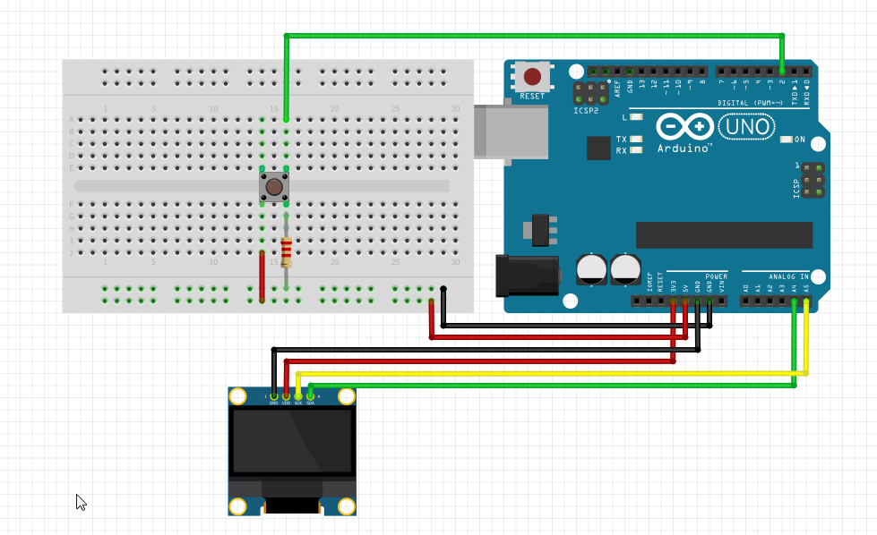

# oled_button_word_list
Create for a 5 year old to practice reading words. 
Using an arduino uno words from a list are display on a oled (SSD1306 128x64) screen for a period (Interval) of time and if read correctly pressing the button adds to the score. 
The score is displayed at the end as a number and as stars. 

The words are stored in the the array WORD, the rest of the logic assumes a 10 word list.

Interval is the amount of time each word is displayed for.

Digital pin 2 is used for the button and analogue pins 4 (SDA) and 5 (SCL) are used for the screen. 

